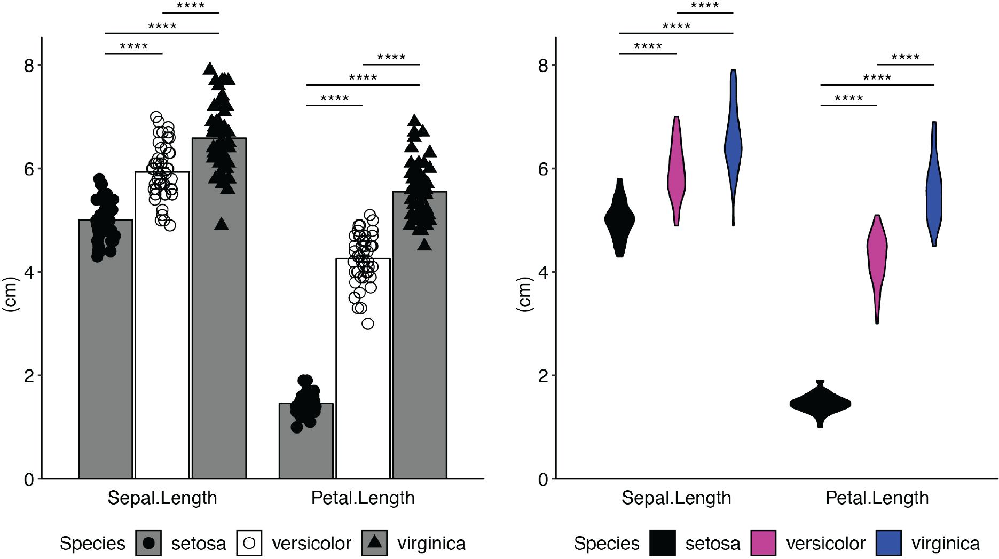
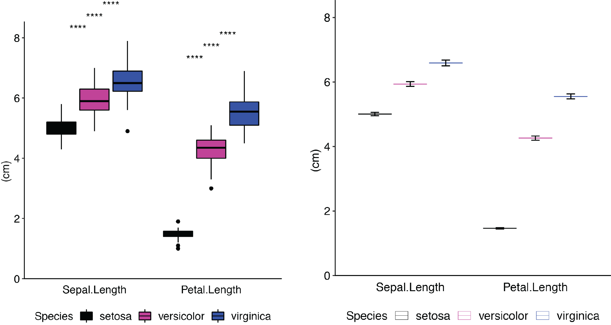

<!-- README.md is generated from README.Rmd. Please edit that file -->

# plotGrouper 

[](https://travis-ci.org/jdgagnon/plotGrouper)
<!-- [ -->

## Overview

plotGrouper is a shiny app wrapper for ggplot2. It is designed to make
the visualization of data and statistical analysis as straightforward as
possible through the use of dropdown menus and checkboxes. Plots created
within the GUI are easily saved as individual PDFs or as reports with
many plots. Addition of new data can be achieved by re-importing files
and refreshing plots. Analysis of flow cytometry data is especially
integrated with plotGrouper. Count data can optionally be transformed to
return the absolute number of cells in a sample (this feature requires
inclusion of the number of beads per sample and information about any
dilution perfomred).

 <br><br>



## Installation

1.  If you do not already have R installed, or your version is out of
    date, download the latest version
    [Here](https://cran.r-project.org).

<!-- end list -->

  - Optionally, install the latest version of [RStudio
    Desktop](https://www.rstudio.com/products/rstudio/#Desktop).

<!-- end list -->

2.  Download the package from Bioconductor.

<!-- end list -->

``` r
if (!requireNamespace("BiocManager", quietly = TRUE))
  install.packages("BiocManager")
  BiocManager::install("plotGrouper")
```

  - Or install the development version of the package from Github.

<!-- end list -->

``` r
BiocManager::install(“jdgagnon/plotGrouper”)
```

## Usage

Load the package into the R session.

`library(plotGrouper)`

To initialize the shiny app, paste the following code in your R console
and run it.

`plotGrouper()`

Once the web app opens, you can access the `iris` dataset by clicking
the iris button to learn how to use the app. After the `iris` data
loads, the selection windows will be automatically populated and a graph
should be displayed.  
The `Raw Data` tab displays the structure of the data loaded. Your file
should be organized in the following way:

| Unique identifier |  Comparisons  |     Variables      |
| :---------------: | :-----------: | :----------------: |
|   ***Sample***    | ***Species*** | ***Sepal.Length*** |
|     setosa\_1     |    setosa     |        5.1         |
|     setosa\_2     |    setosa     |        4.9         |
|   versicolor\_1   |  versicolor   |         7          |
|   versicolor\_2   |  versicolor   |        6.4         |
|   virginica\_1    |   virginica   |        6.3         |
|   virginica\_2    |   virginica   |        5.8         |
|       etc…        |     etc…      |        etc…        |

These columns can be titled anything you want but values in the columns
are important.

  - The `Unique identifier` column should contain only unique values
    that identify each individual sample (e.g., `Sample` within `iris`
    `Raw Data`).

  - The `Comparisons` column should contain replicated values that
    identify each individual as belonging to a group (e.g., `Species`
    within `iris` `Raw Data`).

  - The `Variables` column(s) should created for each variable you wish
    to plot. The values in these columns must be numeric (e.g.,
    `Sepal.Length`, `Sepal.Width`, `Petal.Length`, `Petal.Width` within
    `iris` `Raw Data`)

After importing a data file, a `Sheet` column will be created and
populated with the sheet name(s) from the file if it came from an excel
spreadsheet or the file name if it came from a csv or tsv file.

  - The `Variables to plot` selection window is used to choose which
    variable(s) to plot (e.g., `Sepal.Width` from the `iris` data). If
    multiple are selected, they will be grouped according to the
    `Independent variable` selected.

  - The `Comparisons` selection window is used to choose which column
    contains the information that identifies which condition each sample
    belongs to (e.g., the `Species` column within the `iris` data).

  - The `Independent variable` selection window is used to select how
    the plots should be grouped. If `variable` is selected (the
    default), the plots will be grouped by the values in `Variables to
    plot`.

  - Use the `Shapes` selector to change the shape of the points for each
    comparison variable.

  - Use the `Colors` selector to change the point colors for each
    comparison variable.

  - Use the `Fills` selector to change the fill color for the other
    geoms being plotted for each comparison variable.

To prevent the `Shapes`, `Colors`, or `Fills` from reverting to their
defaults, click the `Lock` checkboxes.

Individual plots can be saved by clicking `Save` on the `Plot` tab or
multiple plots may be arranged on a single page by clicking `Add plot to
report`. Clicking this button will send the current plot to the `Report`
tab and assign it a number in the `Report plot #` dropdown menu. To
revisit a plot stored in the `Report` tab, select the plot you wish to
restore and click `Load plot from report`. Changes can be made to this
plot and then updated in the `Report` by clicking `Update plot in
report`.

  - The statistics calculated for the current plot being displayed in
    the `Plot` tab are stored in the `Statistics` tab. These can be
    saved by clicking the `Download` button on the `Statistics` tab.

  - The `Plot Data` tab contains the reorganized subset of data being
    plotted.

  - The `Raw Data` tab displays the dataframe that was created upon
    import of the file along with the automatically created `Sheet`
    column.

# Session info

Here is the output of `sessionInfo()` on the system on which this
package was developed:

``` r
sessionInfo()
#> R version 3.5.1 (2018-07-02)
#> Platform: x86_64-apple-darwin15.6.0 (64-bit)
#> Running under: macOS High Sierra 10.13.6
#> 
#> Matrix products: default
#> BLAS: /Library/Frameworks/R.framework/Versions/3.5/Resources/lib/libRblas.0.dylib
#> LAPACK: /Library/Frameworks/R.framework/Versions/3.5/Resources/lib/libRlapack.dylib
#> 
#> locale:
#> [1] en_US.UTF-8/en_US.UTF-8/en_US.UTF-8/C/en_US.UTF-8/en_US.UTF-8
#> 
#> attached base packages:
#> [1] stats     graphics  grDevices utils     datasets  methods   base     
#> 
#> loaded via a namespace (and not attached):
#>  [1] compiler_3.5.1  backports_1.1.2 magrittr_1.5    rprojroot_1.3-2
#>  [5] tools_3.5.1     htmltools_0.3.6 yaml_2.2.0      Rcpp_0.12.18   
#>  [9] stringi_1.2.4   rmarkdown_1.10  highr_0.7       knitr_1.20     
#> [13] stringr_1.3.1   digest_0.6.16   evaluate_0.11
```

<br><br>

# License

GNU GPL-3.0-or-later

[licence](https://www.gnu.org/licenses/gpl.txt)
