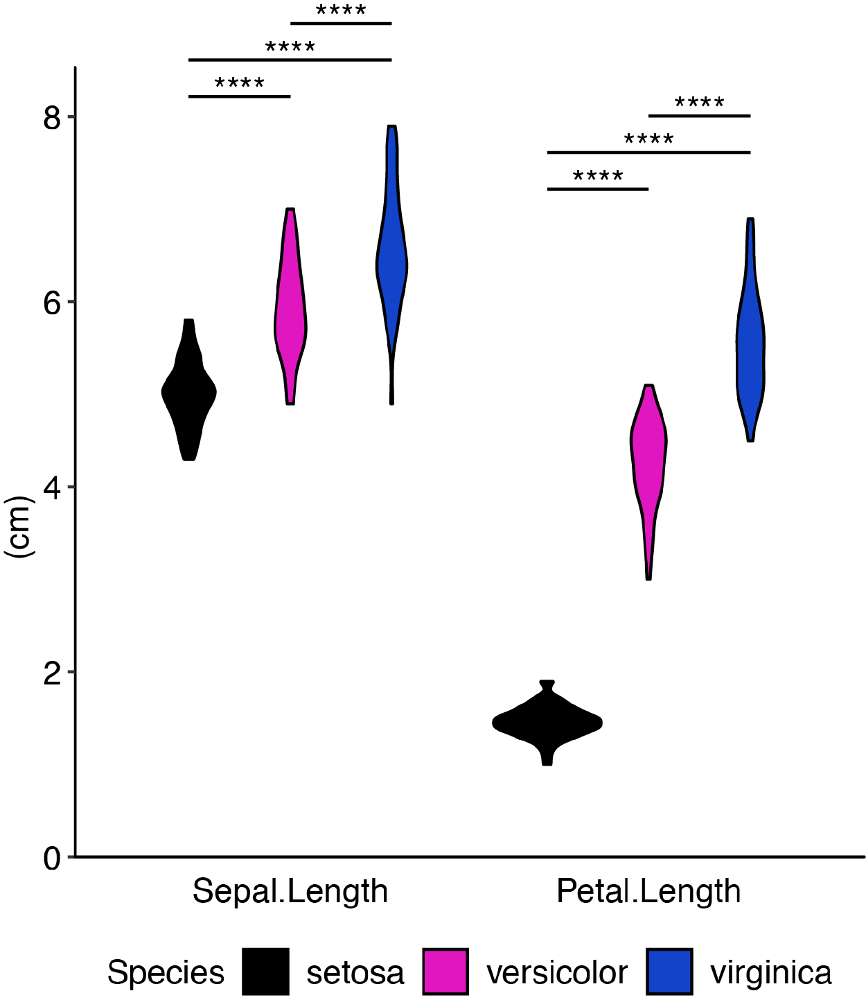

<br>
This package was designed as a tool for generating figure-ready graphs from data in an excel file. It borrows heavily from packages developed by others, including the ggplot2 and dplyr from the tidyverse and batch statistical calculations from ggpubr.
<br><br><br>
Plots can be made using combinations of geoms including bar, violin, box, crossbar, density, point, line, and errorbar.

<br><br>

  

<br><br><br><br>

  


## Getting Started

These instructions will get you a copy of the project up and running on your local machine for development and testing purposes. See deployment for notes on how to deploy the project on a live system.

### Prerequisites

If you do not already have R installed, or your version is out of date, download the latest version [Here](https://cran.r-project.org). 


Next, install the latest version of [RStudio Desktop](https://www.rstudio.com/products/rstudio/#Desktop).

Finally, open RStudio and paste the following code in your R console and run it in order to install the required packages.

```
install.packages("devtools")
devtools::install_github("jdgagnon/plotGrouper")
```

### Installing & Running

After installing these packages, you are ready to run `plotGrouper`.

To initialize the shiny app, paste the following code in your R console and run it.

```
plotGrouper::plotGrouper()
```

Once the web app opens, you can access the `iris` dataset by clicking the iris button to learn how to use the app.


## Authors

* **John Gagnon**

## License

GNU GPL-3.0-or-later

[licence](https://www.gnu.org/licenses/gpl.txt)
